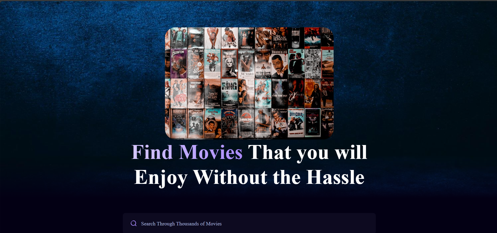
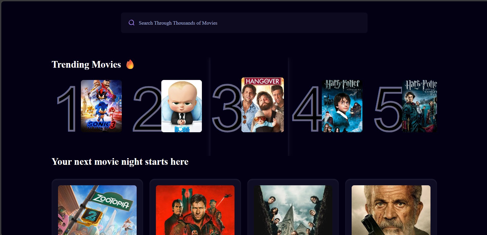
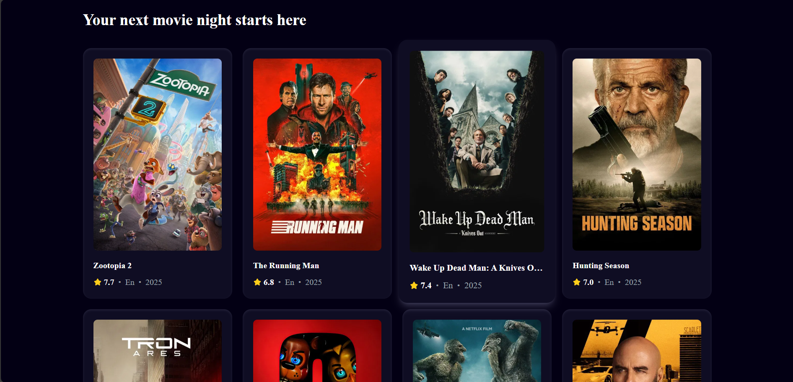
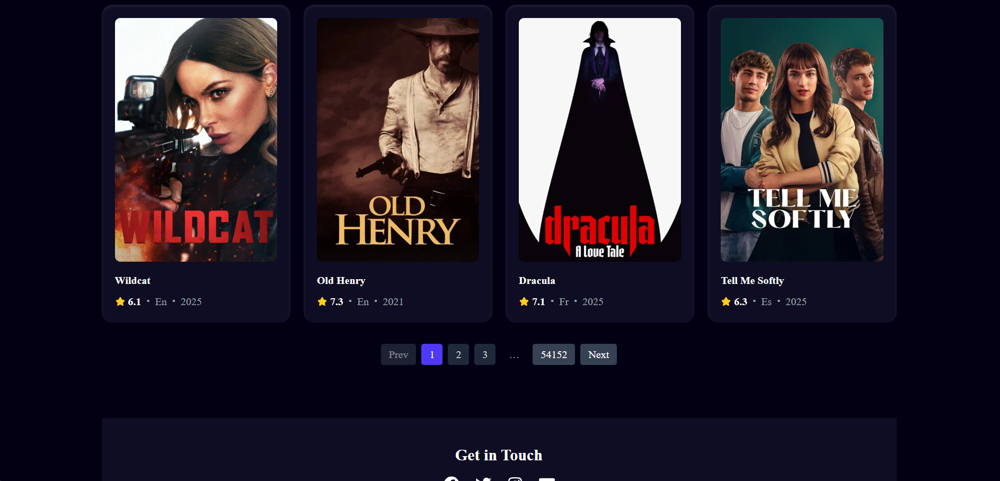

# 🎮 GCMS – Game Center Management System

MovieScope is a modern web application that allows users to search for movies, explore trending films, and browse up-to-date movie listings. Built with React, styled with TailwindCSS, and powered by Appwrite as the backend, it leverages the TMDB API to provide the latest movie data. The app features search functionality, pagination, dynamic movie listings, and fully responsive, making it an engaging movie discovery platform.

---

## 📸 Screenshots

Here are some snapshots of Movie Scope in action:

- **Hero:**  
  

- **Trending Movies:**  
  

- **Movies Listing:**  
  

- **Pagination:**  
  

## 🧭 Overview

- Search for movies using keywords.
- Browse the latest trending and popular movies.
- Navigate through movies with pagination.
- View detailed information about each movie.
- Get real-time updates from the TMDB API.

---

## ✨ Key Features

### 🔍 Search & Discovery

- Search for movies by title
- Real-time results with dynamic updates
- Supports partial and full matches

### 🏷️ Pagination

- Browse through multiple pages of movie results
- Smooth navigation for large datasets

### 🎨 Modern UI

- Responsive design built with TailwindCSS
- Mobile-first, clean layout for all devices
- Interactive and intuitive user experience

### ⚙️ Backend Integration

- Powered by Appwrite for database operations and data management
- Fetches live movie data from TMDB API
- Supports future expansion for user accounts or favorites

---

## 🚀 How to Run

1. Clone the repository
2. Cd Movie-Scope
3. Open the terminal and type (npm install)
4. Run the porjct (npm run dev)

## 📈 Future Enhancements

- User authentication and personalized favorites
- Movie rating and review system
- Dark mode toggle
- Recommendations and watchlists
- Deployment to Vercel / Netlify

## 📄 License

This project is licensed under the MIT License.

## 👤 Author

📧 moneebcodebase@gmail.com
🌐 www.linkedin.com/in/moneeb-al-zakoot
💻 https://github.com/moneebcodebase

Feel free to reach out or contribute via GitHub.
